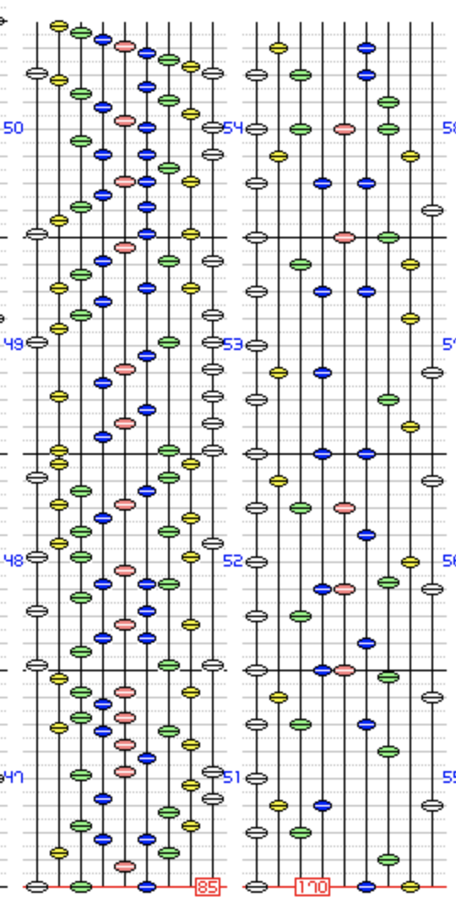
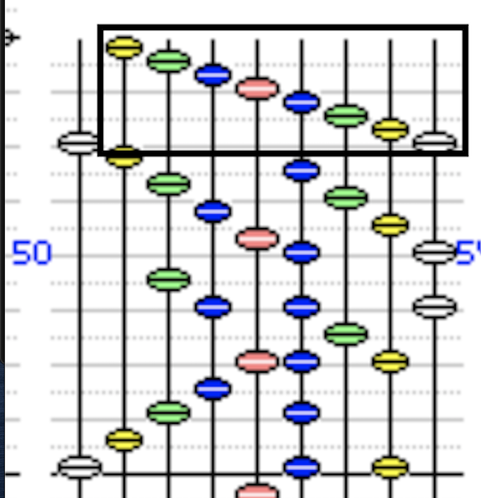
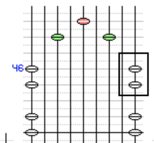

おはようございます。ballenovです。

今日はレベル46にあるハイパージャパネスク3(EX)について書きたいと思います。

## ハイパージャパネスク3(EX) #とは

まずハイパージャパネスク3(EX)を見ていただきましょう。



動画を見れば分かるのですが，1:13ほどから1:25あたりまでBPMが半減し，その間低速を処理する必要があるという譜面です。

## サドプラが使えなさそう

低速部分を見てみると，低速が終わるギリギリまで譜面が階段で埋め尽くされており，一見サドプラが使えなさそうに見えます。

## 低速で残さないといけないのは4粒

ここで，低速でゲージをどの程度残せば勝てるのかを考えてみます。

低速終了後には277ノーツ降ってくるので，低速終了後に全部GREAT以上で繋げられるとすると，低速終了時点で残さなければいけないゲージは

$$17-2\cdot 277\cdot\dfrac{24}{1024} = 4.015625$$

より最低4粒[^atleast4]となります。

## 捨てノーツをうまく作る

サドプラを使えば低速部分をミスなく処理でき，サドプラを使って50小節目に入ったときにはフルゲージであるとします。その時，下の画像の黒枠で囲まれたところを __すべて無視して__ サドプラを外すことを考えます。

このとき，残るゲージは$$24-8\cdot51\cdot\dfrac{24}{1024} = 14.4375$$より14粒となります。4粒残せばクリアのチャンスがあることを考えると充分すぎるほどのゲージが残ります。

## 実践

実際にやってみた結果です。



うまくクリアできることがわかります。

## 補足: 低速突入前にサドプラを付ける方法

低速地帯直前は比較的スカスカなので問題ないと思います。

私が捨てたのは黒枠で囲んだ白2つですが，もしかするとその次の緑2つと赤1つの3ノーツを捨てたほうが視線リセットにもなっていいかもしれません。お好みでどうぞ。

## 結論

人生は諦めないことが大事です。諦めることも大事ですが。

ハイパージャパネスク3(EX)がクリアできなくて困っている方はぜひこの方法を試してみてください!

[^atleast4]: 実際には4粒ギリギリちょうどだと少し足りないです。内部値が171であるときゲージは$171\cdot\dfrac{24}{1024} = 4.0078125 < 4.015625$となります。